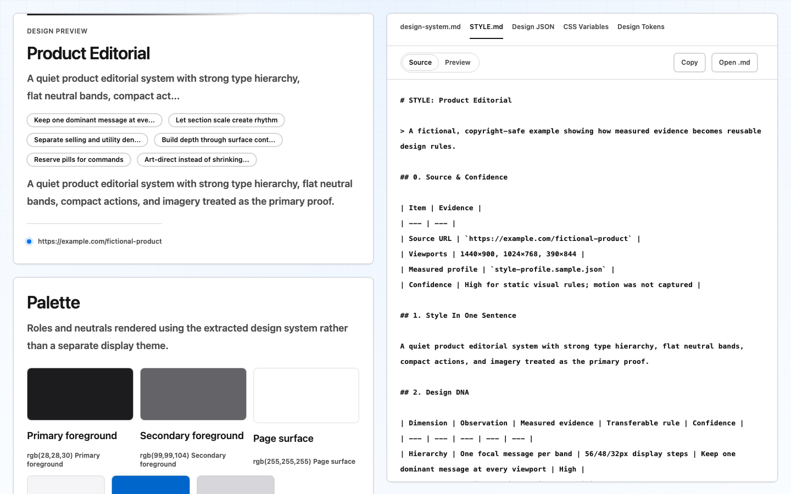

<p align="right">中文 | <a href="README_EN.md">English</a></p>

# HTML2Style

**输入一个网站，轻松生成它的网页风格。**

只需要提供一个网站 URL，HTML2Style 就会自动分析它的颜色、字体、间距、布局、图片、图标和响应式规则，生成可以直接查看、交给 Agent、或应用到新网页的风格包。

```text
网站 URL  →  HTML2Style  →  网页风格包
                              ├─ STYLE.md：风格规则
                              ├─ style-board.html：可视化风格板
                              └─ design-package/：可直接复用的完整文件夹
```

## 30 秒看懂

HTML2Style 主要帮你完成三件事：

1. **提取网页风格：** 自动整理网站的颜色、字体、间距、圆角、布局、图片和响应式特征。
2. **看懂网页风格：** 生成一个可以直接打开的 HTML 风格板，不需要从大量代码里找规律。
3. **复用网页风格：** 把生成的文件夹交给任意 Agent，让它按照这套风格设计新的页面。

它不是简单截一张图，也不是只生成几个颜色值。它会从真实网页中提取一套更完整、可以继续使用的风格规则。

## 最简单的用法：交给 Agent

### 1. 打开项目

```bash
git clone https://github.com/jackguihx-alt/html2style.git
cd html2style
npm install
```

### 2. 对你的 Agent 说

```text
请阅读这个仓库的 SKILL.md，提取 https://example.com 的网页风格，
生成完整的 design-package/，使用中文，不要开始复刻网站。
```

需要迁移风格时可以说：

```text
请阅读 SKILL.md，提取 https://example.com 的网页风格，
并用这套风格为我的产品设计一个新页面。不要复制原站品牌、文案和图片。
```

Codex、Claude Code、Cursor、Copilot 或其他拥有终端能力的 Agent 都可以运行这套流程。运行时使用 Playwright 或本机 Chrome / Chromium / Edge，不依赖某一家 Agent 的专属浏览器。

## 你会拿到什么

最终结果只有一个需要整体保存和移动的文件夹：

```text
design-package/
├── START-HERE.html     # 人类入口：双击查看
├── START-HERE.md       # GitHub / Markdown 入口
├── AGENT-HANDOFF.md    # 新 Agent session 入口
├── manifest.json       # 自动化入口
├── STYLE.md            # 可迁移设计规则
├── style-profile.json  # 确定性测量结果
├── style-board.html    # 可视化风格板
├── advanced/           # 可选：完整设计系统、图标库
└── evidence/           # 可选：浏览器证据、截图
```

不同角色只需要打开对应入口：

| 谁来使用 | 打开什么 |
| --- | --- |
| 产品、设计、评审者 | `START-HERE.html` |
| 新的 Agent session | `AGENT-HANDOFF.md` |
| 开发者 | `STYLE.md` |
| 自动化程序 | `manifest.json` |

下面是生成后的 `style-board.html` 示例。它同时展示设计规则和支撑规则的来源，而不只是一张参考截图。

<p align="center">
  
</p>

查看仓库中的[完整示例包](examples/product-editorial/design-package/)。克隆仓库后，可以在本地双击其中的 `START-HERE.html`；示例使用虚构内容，不重新分发真实网站的品牌和素材。

## 三个典型场景

### 1. 提取网站风格

适合竞品研究、设计审查、设计系统梳理。输出颜色、字体、层级、密度、形状、图片策略、动效与响应式规则，并标注证据和置信度。

### 2. 把风格迁移到新产品

适合“为我的产品设计一个 Apple 风格页面”这类需求。HTML2Style 会保留测量得到的层级、节奏和布局逻辑，同时要求替换原站品牌、内容、信息架构和受保护资产。

### 3. 验证网页复刻

适合有权限的重构、迁移和视觉回归。它会检查页面是否完整、图片来源与裁切是否正确、图标是否缺失、重复组件尺寸是否一致，以及桌面和移动端是否匹配。

## 自己运行 CLI

环境要求：Node.js 20+，以及 Chrome、Chromium、Edge 或 Playwright Chromium。

### 1. 检查浏览器

```bash
npm run doctor
```

### 2. 采集并测量

```bash
node bin/html2style.mjs extract https://example.com evidence.json --profile full
node bin/html2style.mjs profile evidence.json style-profile.json \
  --markdown STYLE-measurements.md
cp assets/STYLE.template.md STYLE.md
```

让 Agent 根据 `STYLE-measurements.md` 和 `assets/STYLE.template.md` 完成 `STYLE.md`。确定性测量与 Agent 的设计解释会分开保存。

### 3. 生成风格板并打包

```bash
node bin/html2style.mjs preview STYLE.md style-board.html

node bin/html2style.mjs bundle design-package \
  --style STYLE.md \
  --profile style-profile.json \
  --board style-board.html \
  --measurements STYLE-measurements.md \
  --evidence evidence.json \
  --locale zh-CN
```

## 跨 session 复用

把整个 `design-package/` 移动到新项目，然后对新的 Agent 说：

```text
阅读 design-package/AGENT-HANDOFF.md，并把这套设计语言应用到我的新任务。
除非交接包明确提示证据缺失，否则不要重新采集参考网站。
```

这就是 `AGENT-HANDOFF.md` 存在的原因：新 Agent 不需要原聊天记录，也不需要再次打开参考网站。

## 为什么比只给截图更可靠

- **真实浏览器证据：** 采集 DOM、计算样式、CSS 变量、SVG、网络资源和实际选中的响应式图片。
- **覆盖不同视口：** 默认检查桌面高/短、平板高/短和移动端，不只验证一张桌面首屏。
- **测量与解释分离：** `style-profile.json` 保存确定数据，`STYLE.md` 保存可读设计规则。
- **明确迁移边界：** 设计原则可以迁移，原站 Logo、文案、图片和品牌身份不能自动继承。
- **结果可以验证：** 资源检查、页面审计和截图对比可以发现缺图、错位和未完成区域。

## 兼容不同 Agent

| 接入方式 | 适合谁 |
| --- | --- |
| CLI | 任何拥有终端权限的用户或 Agent |
| MCP stdio server | 任何兼容 MCP 的客户端 |
| `SKILL.md` | 支持 Skill 的 Agent |
| `AGENTS.md` | Codex 等会读取仓库指令的 Agent |
| `CLAUDE.md` | Claude Code |
| `.cursor/rules` | Cursor |
| Copilot instructions | GitHub Copilot |
| Portable prompt | 其他可以接收项目指令的 Agent |

### 中文与英文

- 中文用户默认生成 `zh-CN` 说明文件。
- 英文用户使用 `--locale en`。
- `START-HERE.md`、`START-HERE.html` 和 `AGENT-HANDOFF.md` 会跟随语言生成。
- 命令、文件名、MCP 工具名和 JSON 字段保持英文，确保自动化与国际协作稳定。
- 原网站内容与测量证据保持原文，除非用户明确要求翻译。

<details>
<summary><strong>MCP 接入</strong></summary>

```bash
npm run mcp
```

```json
{
  "mcpServers": {
    "html2style": {
      "command": "node",
      "args": ["/absolute/path/to/html2style/mcp/server.mjs"]
    }
  }
}
```

配置示例见 [`integrations/mcp.example.json`](integrations/mcp.example.json)。

</details>

<details>
<summary><strong>登录页面与浏览器安装</strong></summary>

没有检测到浏览器时：

```bash
npx playwright install chromium
```

页面需要登录时，打开临时可见浏览器并手动登录：

```bash
node bin/html2style.mjs extract https://example.com evidence.json \
  --headed --login-wait 60
```

HTML2Style 不会请求或保存账号密码。

</details>

<details>
<summary><strong>复刻审计命令</strong></summary>

仅在你有权复刻目标网站时使用：

```bash
node bin/html2style.mjs assets replica.html --base-url https://example.com
node bin/html2style.mjs extract ./replica.html replica-evidence.json --profile full
node bin/html2style.mjs audit evidence.json replica-evidence.json --mode complete
node bin/html2style.mjs compare original.png replica.png comparison.html
```

</details>

## 项目边界

HTML2Style 不会把网页导入 Figma，也不会声称拥有采集到的第三方内容。MIT License 只覆盖本项目代码和模板，不覆盖原网站的图片、字体、Logo、图标、文案或品牌资产。

复杂 Canvas / WebGL、closed shadow root、反爬挑战、视频时间线和所有交互状态目前无法保证完整采集。这些情况会被记录为证据缺口，而不是由 Agent 猜测。

## 相关项目

- [Website to Design](https://websitetodesign.com/)：将网站导入为可编辑 Figma 设计。
- [DesignDNA](https://www.designdna.site/)：通过浏览器扩展导出设计系统文件。
- [Dembrandt](https://github.com/thevangelist/dembrandt)：通过 CLI 和 MCP 提取设计 Token 与品牌信号。
- [brandmd](https://github.com/yuvrajangadsingh/brandmd)：将多页面设计系统提取为 Agent 可读格式。

HTML2Style 更关注响应式浏览器证据、设计迁移边界、跨 session 交接和完整性验证。

## 开发

```bash
npm test
npm run validate
```

提交改动前请阅读 [CONTRIBUTING.md](CONTRIBUTING.md)，安全问题请按照 [SECURITY.md](SECURITY.md) 提交。

## License

MIT。被采集网站的内容和资产仍归原权利人所有。
